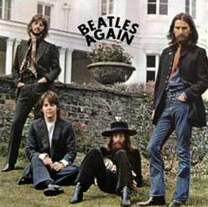
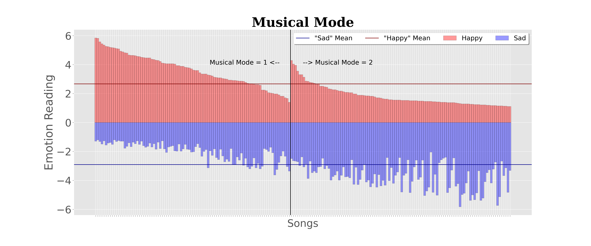
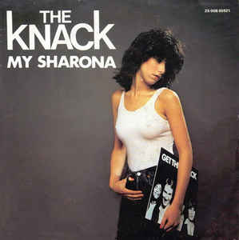
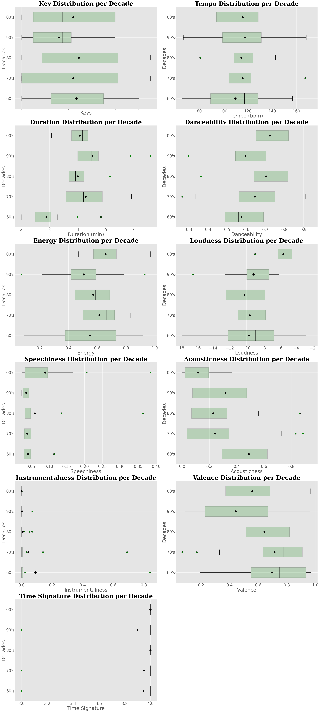

# Understanding Music Data - How to Translate Emotions?

_Capstone I Project_

_by Pedro Meyer_

## Background & Motivation

I have been a musician for about 17 years. As a songwriter, it is interesting to me to understand what makes songs successful, unique and popular. There are many parameters that makes a song sound the way it sounds and they are now widely available for researches to look into.

As Tom Waits said:

> “…You don’t really go to songwriting school…”

Songwriting is an elusive art. Combining lyrics, rythm and melody is a difficult task but one that gives a lot of tools to help tell a story.

I would like to understand the relationship between the parameters that constitute music, called acoustic metadata, with our emotions and the songwriting process, and how their use changed over the years. This project aims to establish a relationship between the acoustic metadata to the way people feel, and how that relates to popular tunes through the decades, form the 60's to the 2000's. 

## Data

Frontiers in Psychology published a study from the Department of Music, University of Jyväskylä, Finland and the Department of Speech, Music, and Hearing, KTH - Royal Institute of Technology, Stockholm, Sweden, conducted by Tuomas Eerola in 2016, aimed to correlate the acoustic metadata with emotion expression. This study can be found [here](https://www.frontiersin.org/articles/10.3389/fpsyg.2013.00487/full). This dataset had to be concatenated using pandas, since the emotion reading and the cues values came in different files. 

This study took 46 participants with musical background and exposed them to 200 audio stimuli. Listeners rated the 200 musical examples according to four perceived emotional characters (happy, sad, peaceful, and scary. Each audio example had 6 cues, such as tempo and time signature.

 Nro |   Scary |   Happy |    Sad |   Peaceful |   Register |   Mode |   Tempo |   Soundlevel |   Articulation |   Timbre |   Melody 
 ---:|------:|--------:|--------:|-------:|-----------:|-----------:|-------:|--------:|-------------:|---------------:|---------:
1 |  1.2889 |  4.4667 | 1.7111 |     3.1333 |  4 |      1 |       4 |            4 |  2 |        2 |        4 
2 |  1.0667 |  5.4444 | 1.4889 |     4.4889 |  5 |      1 |       4 |            1 |  1 |        2 |        2   
3 |  2.0222 |  1.4889 | 3.7778 |     2.7111 |  2 |      2 |       5 |            1 |  1 |        2 |        1  
4 |  2.2889 |  4.1111 | 1.2667 |     1.4889 |  1 |      1 |       5 |            4 |  4 |        1 |        2  
5 |  1.4    |  1.4667 | 5.0444 |     3.8444 |  3 |      2 |       1 |            3 |  2 |        2 |        1  

In order to correlate the significance of emotions and popular music, I have collected data from the [Billboard](https://www.billboard.com/articles/news/6296373/billboard-hot-100-1960) charts, summarizing the top 20 songs per decade, from the 60's to the 2000's. The metadata for each track is based off of the dataset created by a company called [The Echo Nest](https://en.wikipedia.org/wiki/The_Echo_Nest), which has released data on over 1 million songs. Echo Nest has since been purchased by Spotify, which made this data available [here](https://developer.spotify.com/console/get-audio-features-track/?id=39ibr95QHNF1YhHV9as24E). 

## How Does Music Influences Our Emotions?

We know we feel things when we listen to music. Something about the sound that takes us places we don't choose to go. As Plato put it:

> "Music and rhythm find their way into the secret places of the soul"

How can songwriters do that? Can this data be manipulated by artists at will so to give listeners a crafted response? 

The aim of mentioned study "Emotional expression in music: contribution, linearity, and additivity of primary musical cues" was:

> To manipulate musical cues systematically to determine the aspects of music that contribute to emotional expression.

Their data gives insight on what can be manipulated to give a percieved notion of "happyness", "sadness", "scare" or "peacefulness". Since each emotion is influenced by many factors simultaneously, I chose to exemplify the findings of the study by using the relationship of "happy" and "sad" emotions with the "Mode" cue. 

> In the theory of Western music, a mode is a type of musical scale coupled with a set of characteristic melodic behaviors.

Think of these scales as the road map to every note used in a song.

## Reference:

### Major Key (Mode 1)
#### ***Hey Jude - The Beatles***

Name     | Artist      |   Decade |   Rank |   danceability |   energy |   key |   loudness |   speechiness |   acousticness |   instrumentalness |   liveness |   valence |   tempo |   duration_ms |   time_signature | Country   | City  
 ---:|:---------|:------------|---------:|-------:|---------------:|---------:|------:|-----------:|--------------:|---------------:|-------------------:|-----------:|----------:|--------:|--------------:|-----------------:|:----------
Hey Jude | The Beatles |       60 |      2 |          0.462 |    0.632 |     5 |     -7.438 |        0.0248 |          0.091 |                  0 |      0.397 |     0.585 |  74.268 |        238854 | 4 | England   | Liverpool |

### Minor Key (Mode 2)
#### ***Hello - Adele***

Name   |   Album | Artist   |   Danceability |   Duration |   Energy | Explicit   |   Instrumentalness |   Liveness |   Loudness |   Mode |   Acousticness |   Popularity |   Speechiness |   Tempo |   TimeSignature |   Valence 
 -------:|:-------|--------:|:---------|---------------:|-----------:|---------:|:-----------|-------------------:|-----------:|-----------:|-------:|---------------:|-------------:|--------------:|--------:|----------------:
 | Hello  |      25 | Adele    | 0.481 |     295493 |    0.451 | False      | 0 |     0.0872 |     -6.095 |      0 |          0.336 |           73 |        0.0347 | 157.966 | 4 |     0.289 |'
 

&nbsp;  

Below we analyse only the major, or ionian mode (1), and minor, or aoelian mode (2).

We see that within major intervals (musical mode = 1), more 'happy' data is above it's mean than 'sad'. That is the oposite within data with minor intervals (musical mode = 2). In our examples, the song 'Hey Jude" feels hopeful and uplifting, while "Hello" is sad. Even though these are cherry picked examples, they are a good representative of using major or minor keys to set up a mood.

The same relationship can be found on the other cues, though with different intensities and patterns. In each different value of the cue, we can see a different distribution of 'happy' and 'sad' responses.

Each indentation on the graph means a change on the value of the cue. On Tempo, it is very clear that as the bpm goes up, songs are percieved more as happy, while slow songs as sad. The Register, which is the key in which the song is in, shows less of a relationship on the percieved emotion expression.

Here are two very opposite examples. Now we can hear some of these cues in action to make a song have different moods.

name | artist | decade | rank | danceability | energy | key |   loudness | speechiness | acousticness | instrumentalness | liveness |   valence | tempo | duration_ms | time_signature | country | city 
|---:|:------|:----------|---------:|-------:|---------------:|---------:|------:|-----------:|--------------:|---------------:|-------------------:|-----------:|----------:|--------:|--------------:|-----------------:|:--------------|
My Sharona | The Knack |       70 |     15 |          0.586 |      0.7 |     0 |     -9.558 |        0.0363 |         0.0589 |            0.00125 |     0.0318 |     0.897 | 147.245 |        295400 |                4 | United States | Los Angeles |

|Name | Album | Artist | Acousticness |  Danceability | Duration |   Energy | Explicit |   Instrumentalness |   Liveness |   Loudness |   Mode | Popularity | Speechiness |   Tempo | TimeSignature |   Valence |
|-------------:|---------------:|:----------|:-----------|---------------:|-----------:|---------:|:-----------|-------------------:|-----------:|-----------:|-------:|:--------|-------------:|--------------:|--------:|----------------:
|Gravity|Continuum|John Mayer|0.731|0.764|245827|0.326|False|0.0013|0.24|-9.883|1|76|0.0342|123.98|3|0.237|

&nbsp;  
## Acoustic Data in Popular Music

The Echo Nest developed a system to cathegorize over a million popular songs. This data is now widely available and it has become a stardard on music research. Armed with this tool, we can compare songs through decades, artists and genres. With that, we are able to infer the make up of a successful song.

The [Billboard Charts](https://www.billboard.com/charts) have always been a good measure of success. I have analysed the acoustic data for the Top 20 songs of each decade, from the 60's to the 2000's, and compared the average value of each of their parameters, as well as their distribution using box charts. Here we can see if there is a lot of change between decades, or no change at all. 

name               | artist          |   decade |   rank |   key |   tempo |   duration_m |   danceability |   energy |   loudness |   speechiness |   acousticness |   instrumentalness |   valence |   time_signature 
---:|:-------------------|:----------------|---------:|-------:|------:|--------:|-------------:|---------------:|---------:|-----------:|--------------:|---------------:|-------------------:|----------:
 We Belong Together | Mariah Carey    |     2000 |      1 |     0 | 139.975 |         3.36 |          0.838 |    0.469 |     -7.992 |        0.0835 |        0.0358  |           0        |     0.778 |                4 |\n| 80 | \
Yeah!              | Usher           |     2000 |      2 |     2 | 105.018 |         4.17 |          0.894 |    0.791 |     -4.699 |        0.112  |        0.0183  |           0        |     0.583 |                4 |\n| 81 \
 Low                | Flo Rida        |     2000 |      3 |    10 | 128.008 |         3.86 |          0.918 |    0.609 |     -5.64  |        0.0791 |        0.0928  |           0        |     0.304 |                4 |\n| 82 \
  I Gotta Feeling    | Black Eyed Peas |     2000 |      4 |     0 | 127.965 |         4.82 |          0.741 |    0.748 |     -6.299 |        0.0264 |        0.0823  |           0        |     0.6   |                4 |\n| 83 \
   How You Remind Me  | Nickelback      |     2000 |      5 |    10 | 172.011 |         3.74 |          0.432 |    0.795 |     -4.023 |        0.0321 |        0.00128 |           0        |     0.519 |                4 |\n| 84 \
No One             | Alicia Keys     |     2000 |      6 |     1 |  90.042 |         4.23 |          0.644 |    0.548 |     -5.416 |        0.0286 |        0.0209  |           8.68e-06 |     0.166 |                4 |'
 

====
For a songwriter, this is interesting to observe. Take the Speechiness distribution: The songs in the 2000's have more words than in the previous decades. That can be attributed to a higher popularity of rap, R&B and hip hop genres, as well as different recording trends in pop music, such as shorter intros.

The tempo distribution is also quite interesting. It appears that ballads weren't particularly popular in the 80's.

## Conclusion
It is clear that while music taste is still quite subjective, we can see clear trends on the occurance of some features in songs through time. 

Looking at the distribution of the cues per decade, we can see how some features remained popular over the decades, like time signature, while others, not so much, like the speechiness. 

That is a great music consumption indicative that can be further explored, but even more importantly, it is perhaps a window into the general mood of the people of each decade. 

## Term Glossary

### Frontiers in Psychology Dataset
**Nro** = Stimilus Number \
**Register** = 6 levels (53, 59, 65, 71, 77, and 83 in MIDI Tuning Standard or MTS). The whole piece was transposed so that the average pitches of the melody were the following: F3, B3, F4, B4, F5, and B5 corresponding to the MIDI note numbers 53, 59, 65, 71, 77, and 83, respectively. \
**Mode** = 2 levels (1 major, 2 minor) \
**Tempo** = 5 levels (1.2, 2, 2.8, 4.4, and 6 NPS (notes per second, see the paper for details) \
**Sound level / Dynamics** = 5 levels (-10, -5, 0, +5, +10 dB). This change corresponds to how the sound level and timber change simultaneously according to played dynamics in the real counterpart of the respective acoustic instrument. \
**Articulation** = 4 levels (1, 0.75, 0.5, 0.25 from legato to staccato. Defined as the duration of a note relative to its interonset interval.  \
**Timbre** = 3 levels (1= trumpet, 2 = flute, 3 = horn) \
**Melody** = 4 categories (1 = Sad [T01.mid], 2 = Happy [G04.mid], 3 = Scary [P02.mid], 4 = Peaceful [A02.mid], filenames refer to Montreal battery of composed emotion examples (Vieillard et al., 2008. Note that the musical excerpts can be used for research with ackowledgements of the copyright, © Bernard Bouchard, 1998.)

[Eerola, T., Friberg, A., & Bresin, R. (2013). Emotional Expression in Music: Contribu- tion, Linearity, and Additivity of Primary Musical Cues. Frontiers in Psychology, 4(487).](http://www.frontiersin.org/emotion_science/10.3389/fpsyg.2013.00487/abstract)

The stimulus examples were generated with an algorithm using the Director Musices software [Friberg et al., 2000](https://www.tandfonline.com/doi/abs/10.1080/09298219808570749).

---------------------
### Echo Nest Dataset

**key**	| int |	The estimated overall key of the track. Integers map to pitches using standard Pitch Class notation . E.g. 0 = C, 1 = C♯/D♭, 2 = D, and so on. If no key was detected, the value is -1. 

**tempo**	| float |	The overall estimated tempo of a track in beats per minute (BPM). In musical terminology, tempo is the speed or pace of a given piece and derives directly from the average beat duration. 

**mode** | int | Mode indicates the modality (major or minor) of a track, the type of scale from which its melodic content is derived. Major is represented by 1 and minor is 0.

**duration_ms**	| int |	The duration of the track in milliseconds. 

**danceability**	| float |	Danceability describes how suitable a track is for dancing based on a combination of musical elements including tempo, rhythm stability, beat strength, and overall regularity. A value of 0.0 is least danceable and 1.0 is most danceable.

**energy**	| float |	Energy is a measure from 0.0 to 1.0 and represents a perceptual measure of intensity and activity. Typically, energetic tracks feel fast, loud, and noisy. For example, death metal has high energy, while a Bach prelude scores low on the scale. Perceptual features contributing to this attribute include dynamic range, perceived loudness, timbre, onset rate, and general entropy.

**loudness**	| float |	The overall loudness of a track in decibels (dB). Loudness values are averaged across the entire track and are useful for comparing relative loudness of tracks. Loudness is the quality of a sound that is the primary psychological correlate of physical strength (amplitude). Values typical range between -60 and 0 db.

**speechiness**	| float |	Speechiness detects the presence of spoken words in a track. The more exclusively speech-like the recording (e.g. talk show, audio book, poetry), the closer to 1.0 the attribute value. Values above 0.66 describe tracks that are probably made entirely of spoken words. Values between 0.33 and 0.66 describe tracks that may contain both music and speech, either in sections or layered, including such cases as rap music. Values below 0.33 most likely represent music and other non-speech-like tracks.

**acousticness**	| float |	A confidence measure from 0.0 to 1.0 of whether the track is acoustic. 1.0 represents high confidence the track is acoustic. 

**instrumentalness**	| float |	Predicts whether a track contains no vocals. “Ooh” and “aah” sounds are treated as instrumental in this context. Rap or spoken word tracks are clearly “vocal”. The closer the instrumentalness value is to 1.0, the greater likelihood the track contains no vocal content. Values above 0.5 are intended to represent instrumental tracks, but confidence is higher as the value approaches 1.0. \

**valence**	| float |	A measure from 0.0 to 1.0 describing the musical positiveness conveyed by a track. Tracks with high valence sound more positive (e.g. happy, cheerful, euphoric), while tracks with low valence sound more negative (e.g. sad, depressed, angry). \

**time_signature**	| int |	An estimated overall time signature of a track. The time signature (meter) is a notational convention to specify how many beats are in each bar (or measure). 

## Citation

[Eerola T, Friberg A and Bresin R (2013) Emotional expression in music: contribution, linearity, and additivity of primary musical cues. Front. Psychol. 4:487. doi: 10.3389/fpsyg.2013.00487](https://www.frontiersin.org/articles/10.3389/fpsyg.2013.00487/full)

